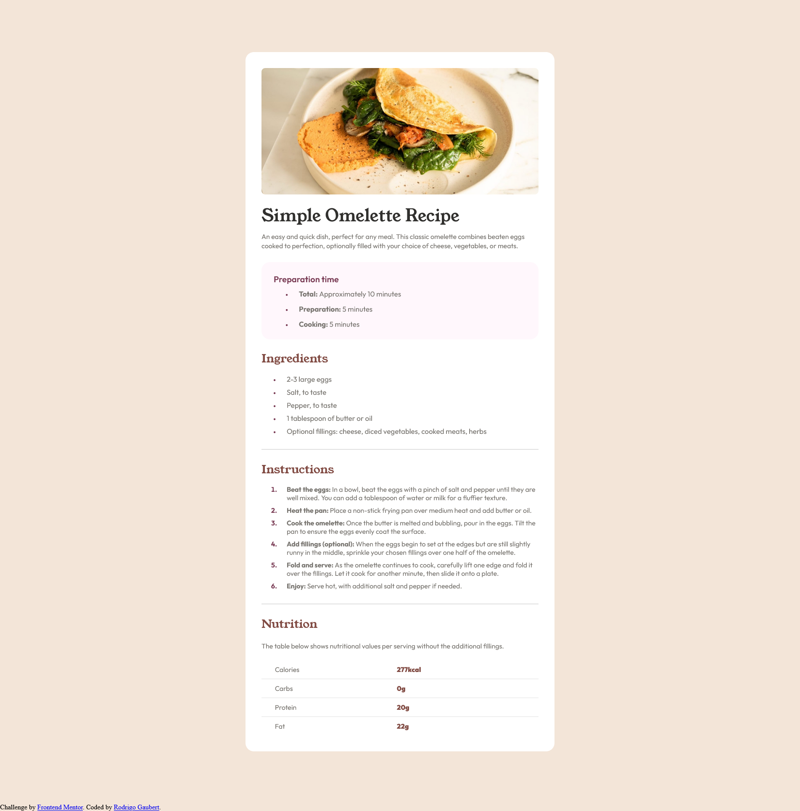

# Frontend Mentor - Recipe page solution

This is a solution to the [Recipe page challenge on Frontend Mentor](https://www.frontendmentor.io/challenges/recipe-page-KiTsR8QQKm). Frontend Mentor challenges help you improve your coding skills by building realistic projects. 

## Table of contents

- [Overview](#overview)
  - [The challenge](#the-challenge)
  - [Screenshot](#screenshot)
  - [Links](#links)
- [My process](#my-process)
  - [Built with](#built-with)
  - [What I learned](#what-i-learned)
  - [Continued development](#continued-development)
- [Author](#author)

## Overview

### The challenge

El desafio consistia en construir una pagina web de una receta, solamente con el diseño presentado en las fotos.

### Screenshot

### Links

- Live Site URL: [URL](https://rodrigogg14.github.io/RecipePage/)

## My process

### Built with

- Semantic HTML5 markup
- CSS
- Media Query
- CSS Grid
- Figma
- Pixso
- Desktop-first workflow
- Firefox for development
- Chrome lighthouse

### What I learned

Gracias a este proyecto, pude practicar mis conocimientos de HTML y CSS, ademas de aprender acerca del diseño responsive.

### Continued development

Tengo que continuar con el responsive design, ya que esto fue una de las cosas que mas me complico en algunos momentos.
Igualmente debo enfocarme en el mobile-first design, ya que en este proyecto me enfoque en el desktop-first.

## Author

- Website - [Rodrigo Gaubert](https://github.com/RodrigoGG14)
- Frontend Mentor - [@RodrigoGG14](https://www.frontendmentor.io/profile/RodrigoGG14)

